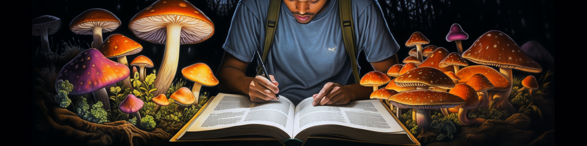
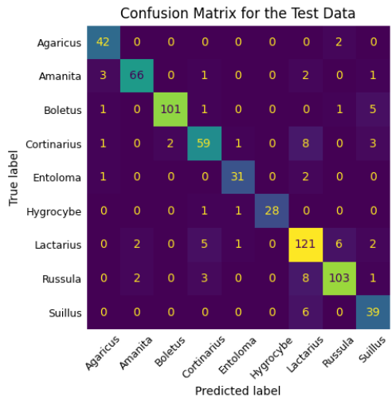
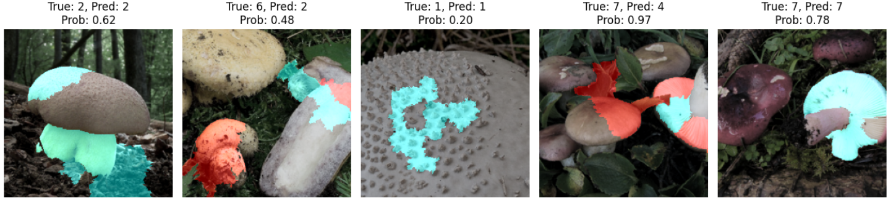

# Mushroom Species Recognition

## Dataset

The dataset for this project can be found on [Kaggle](https://www.kaggle.com/datasets/maysee/mushrooms-classification-common-genuss-images) (licensed under CC0: Data files © Original Authors).

The "Mushroom Classification - Common Genera Species" dataset from Kaggle contains 6,617 images of nine mushroom species. This makes it well-suited for training computer vision models to recognize and classify mushrooms based on appearance. The dataset includes both edible and highly toxic species, such as Amanita, Cortinarius, and Entoloma, as well as genera like Russula and Lactarius, which feature both edible and mildly toxic varieties. Most images are well-centered close-ups of mushrooms on the ground, taken in good lighting with portrait orientation. 

The dataset presents a few challenges. Class distribution is imbalanced, with some species represented by significantly more images than others. Additionally, nine images were removed for not depicting mushrooms, around 90 are duplicated, and one corrupted image was discarded. A key issue is that subspecies within the same species can sometimes look more different from each other than from subspecies of other species.

## Objectives

The main objective of the project is:

> **Develop a model for a mobile app backend to classify mushroom species.**

The app is intended for foragers who pick up mushrooms and attempt to identify them. This means I aim to achieve good overall results (accuracy) while making sure no individual class falls behind (i.e., no class has a much lower F1 score than the others).

As the project progressed, I realized that some errors cannot be fully avoided, and misclassifying a poisonous mushroom as non-poisonous is unacceptable due to the risk of poisoning. A better goal for app users who prioritize safety over identifying the exact species is:

> *Develop a model for a mobile app backend to classify if a mushroom is eatable or not.*

## Results

The tested pre-trained models are ResNet18 and ResNet34. The training process included multiple steps: training only the output layer, adding an intermediate layer, unfreezing half of the model's layers, and finally unfreezing all layers. Softmax Cross Entropy Loss function and the AdamW optimizer were used, with rotational and horizontal flip augmentations to increase data variability. ResNet34 achieved approximately 5% higher accuracy than ResNet18.

    

 

> **The model achieves 90% accuracy on the test dataset, with consistent performance across all classes.**

Threshold adjustments successfully separate poisonous mushrooms ("Amanita" "Cortinarius" and "Entoloma") from non-poisonous ones. The next step would be to adopt a binary classification approach, distinguishing mushrooms as "poisonous" or "non-poisonous," and consider hierarchical or multi-task models to balance safety with species identification.

### Model Explainability and Improvements

LIME visualization shows the parts of the image that influenced the model's decision. Cyan areas support the predicted class, while red areas oppose it.  

- The model sometimes relies on background information, such as grass or leaves, for both correctly and incorrectly classified images, rather than focusing on the mushroom itself. This suggests the need for additional augmentation steps to hide irrelevant areas, such as cropping to isolate the mushroom, blurring the background, or masking irrelevant areas.
- Some misclassified images are challenging to classify due to being highly zoomed in or taken from unusual angles. To address this, I could explore zoom, perspective and cutout augmentations.
- Misclassifications may also stem from significant variations within a species, where some subspecies appear more similar to those of other species. Predicting subspecies labels could improve the model's performance, but this data is currently unavailable and would need to be sourced or labeled.

