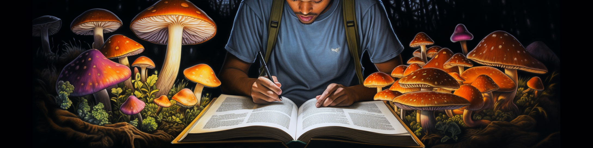
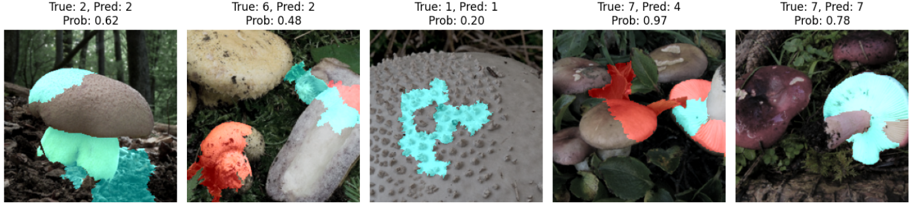

# Mushroom Species Recognition

## Dataset

The dataset for this project can be found on [Kaggle](https://www.kaggle.com/datasets/maysee/mushrooms-classification-common-genuss-images) (licensed under CC0: Data files © Original Authors).

The "Mushroom Classification - Common Genera Species" dataset from Kaggle provides a collection of images across nine mushroom species (genera), highlighting their unique visual characteristics to support the development of computer vision models for classification. These include both edible and highly toxic species, such as Amanita, Cortinarius, and Entoloma, while others like Russula and Lactarius feature both edible and mildly toxic varieties. Additionally, subspecies within a species can sometimes visually differ more from each other than they do from subspecies of other species, adding complexity to classification.

The dataset also has a few minor issues: 9 images were removed as they did not depict mushrooms, close to 90 images are duplicated, and a single corrupted image was removed. Most images are well-centered close-ups of mushrooms on the ground, captured with good picture quality and lighting in a portrait orientation. These are the types of images the app users would have to take to get the most accurate predictions.

## Objectives

The main objective of the project is:

> **Develop a model for a mobile app backend to classify mushroom species.**

The app is intended for foragers who pick up mushrooms and attempt to identify them. This means that I aim to achieve good overall results (accuracy) while ensuring that no individual class lags behind (F1 score).

As the project progressed, a critical challenge became evident: the model cannot perfectly classify all mushroom species, and incorrectly identifying a poisonous mushroom as non-poisonous is unacceptable, as it could lead to poisoning. For app users, who would prioritize safety over the exact species, a better goal is:

> *Develop a model for a mobile app backend to classify if a mushroom is eatable or not.*

I evaluated whether the model I developed could achieve this goal and outlined an action plan for future work.

## Results

The tested pre-trained models are ResNet18 and ResNet34. The training process included multiple steps: training only the output layer, adding an intermediate layer, unfreezing half of the model's layers, and finally unfreezing all layers. Softmax Cross Entropy Loss function and the AdamW optimizer were used, with rotational and horizontal flip augmentations to increase data variability. ResNet34 achieved approximately 5% higher accuracy than ResNet18.

    

 

> **The model achieves 90% accuracy on the test dataset, with consistent performance across all classes.**

Threshold adjustments successfully separate poisonous mushrooms ("Amanita" "Cortinarius" and "Entoloma") from non-poisonous ones. The next step would be to adopt a binary classification approach, distinguishing mushrooms as "poisonous" or "non-poisonous," and consider hierarchical or multi-task models to balance safety with species identification.

### Model Explainability and Improvements

LIME visualization shows the parts of the image that influenced the model's decision. Cyan areas support the predicted class, while red areas oppose it.  

- The model sometimes relies on background information, such as grass or leaves, for both correctly and incorrectly classified images, rather than focusing on the mushroom itself. This suggests the need for additional augmentation steps to hide irrelevant areas, such as cropping to isolate the mushroom, blurring the background, or masking irrelevant areas.
- Some misclassified images are challenging to classify due to being highly zoomed in or taken from unusual angles. To address this, I could explore zoom, perspective and cutout augmentations.
- Misclassifications may also stem from significant variations within a species, where some subspecies appear more similar to those of other species. Predicting subspecies labels could improve the model's performance, but this data is currently unavailable and would need to be sourced or labeled.

